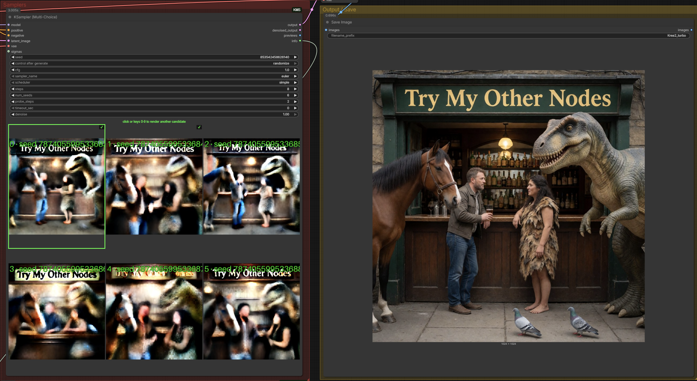
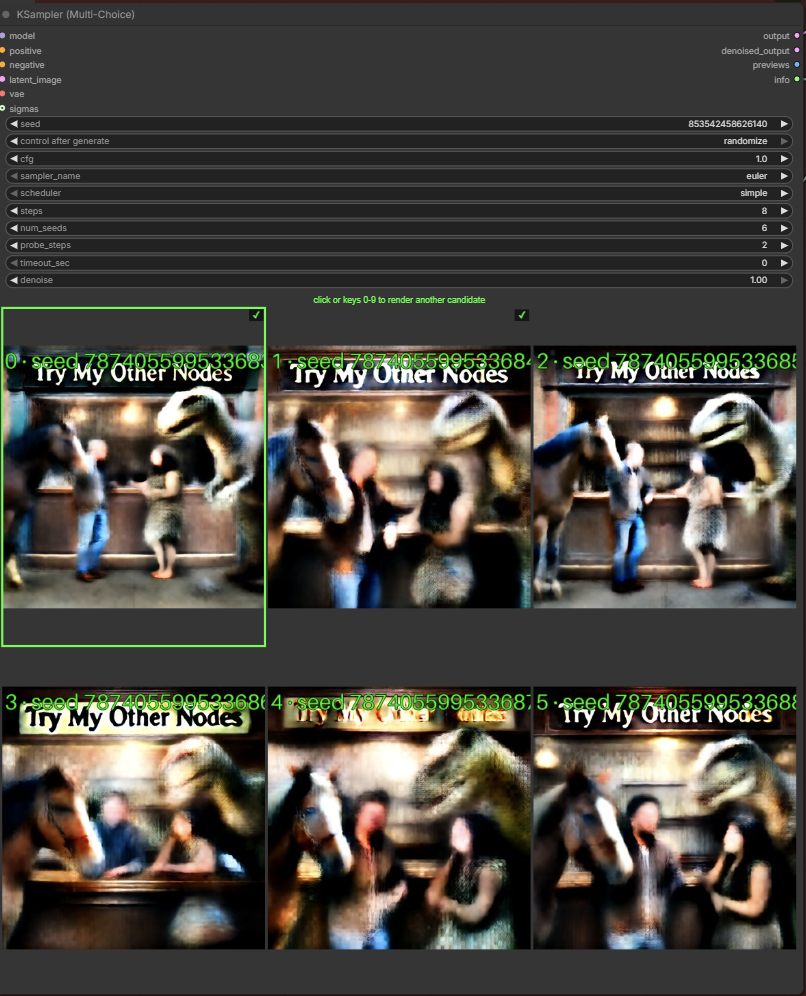

# KSampler Multi-Choice

[](https://buymeacoffee.com/lorasandlenses)
[](LICENSE)

See what your seeds have in mind before you spend the steps. Quick previews
appear right on the node — click your favourite and **only that image gets
rendered**.



## What it does

1. **Probe pass** — runs just the first `probe_steps` steps for each of
   `num_seeds` consecutive seeds. Enough to see the scene each seed will produce.
2. **Pause** — the node stops and shows the candidates as clickable thumbnails
   drawn right on the node. No popup, no extra window.
3. **Click one** (or press its number key) — it finishes **only that seed's
   image**, continuing the trajectory from the probe endpoint. No probe work is
   wasted, and with deterministic samplers the result is bit-identical to a
   normal full render of that seed.
4. **Changed your mind?** After the run, the thumbnails stay clickable. Click
   any other candidate and it renders too — the workflow re-queues and continues
   that seed straight from its cached probe endpoint (no re-probe, no waiting).
   Rendered candidates get a ✓ mark.



## Why you'd want it

Seed roulette is expensive. Rendering 8 full images to find one keeper on an
8-step model costs 64 model steps. With Multi-Choice, browsing 8 seeds and
finishing your pick costs **~22 steps** — and every extra candidate you click
afterwards costs only the remaining steps (~6 in that example).

The killer detail: the probe isn't a throwaway preview pass. The picked seed
*continues* from where its probe stopped, so what you clicked is exactly what
you get.

The cached candidates invalidate automatically when anything that affects them
changes (model, prompts, latent, cfg, sampler, schedule…) — but **not** when the
seed widget ticks over from `control_after_generate`, so clicking a thumbnail
always renders exactly the candidate you see.

## Model support

Model agnostic. The continuation uses ComfyUI's split-sigma convention
(zero-noise resume), which is exact for classic EPS models and flow/CONST
models alike.

| Model type | probe_steps | cfg | Notes |
|---|---|---|---|
| Distilled (turbo / TDM / Lightning…) | 1–2 | 1.0 | Composition commits in the first step or two — browsing is nearly free. **This is the sweet spot.** |
| Classic multi-step (SDXL, etc.) | ~20–30% of steps | your usual | More probe steps so the previews are readable. |

## Install

```
cd ComfyUI/custom_nodes
git clone https://github.com/shootthesound/ComfyUI-KMS
```

Restart ComfyUI and hard-refresh your browser. No additional Python
dependencies.

## Example workflow

A ready-to-go Krea 2 example is included in
[`example_workflows`](example_workflows/) — load it from ComfyUI's workflow
Templates browser (it appears under this pack's name), or just drag the JSON
onto the canvas.

## Quick start

1. Add **KSampler (Multi-Choice)** (category: `sampling`) in place of your
   normal KSampler.
2. Wire **model / positive / negative / latent** as usual, plus a **vae** —
   it's used to decode the candidate previews (a fast preview VAE like
   taesd/taew works too).
3. Set `steps` to your model's normal count, `probe_steps` per the table above.
4. Queue. When the thumbnails appear, click the one you want. Done.

## Inputs

Standard KSampler-style widgets — guider, noise, sampler and schedule are all
built internally. No RandomNoise / CFGGuider / KSamplerSelect / BasicScheduler
wiring needed.

| Input | What it does |
|---|---|
| `seed` | Base seed — seeds `seed`, `seed+1`, … `seed+num_seeds-1` are probed |
| `cfg` | 1.0 for distilled / CFG-free models (negative pass skipped); otherwise your model's usual value |
| `sampler_name` | Deterministic samplers (euler, etc.) make the finished image exactly match a normal run of that seed |
| `scheduler` / `steps` | The full schedule, derived from the model (same as BasicScheduler) |
| `num_seeds` | How many consecutive seeds to browse — one thumbnail each |
| `probe_steps` | Steps run per seed before its preview is captured |
| `timeout_sec` | Auto-pick candidate 0 after this many seconds. 0 = wait forever |
| `denoise` | 1.0 = txt2img. Lower it to browse seeds for an img2img / refine pass on your input latent, exactly like a standard KSampler |
| `sigmas` (optional) | Custom schedule override — replaces scheduler/steps/denoise |

Outputs the same `output` / `denoised_output` pair as `SamplerCustomAdvanced`,
plus the labelled preview sheet as an IMAGE and an info string.

## Controls while choosing

| Action | What it does |
|---|---|
| **Click** a thumbnail | Finish that candidate |
| **Keys 0–9** | Same as clicking — pick by the number stamped on the thumbnail |
| **Shift-hover** | Enlarge a thumbnail for a closer look before committing |

Both click and number keys keep working **after the run** — each one queues
that candidate for an immediate re-render from its cached probe endpoint. Want
several? Pick your favourite, then click (or key) the others as each run
finishes — all from the same probe pass, each through your normal Preview/Save
nodes.

## Waiting behaviour

While the node waits for your click the queue is paused. **Cancel** aborts the
run cleanly. For unattended or headless runs, set `timeout_sec` and it
auto-picks candidate 0 after that long.

## Tips

- **Make the node bigger.** The thumbnails scale with the node — drag it out to
  a comfortable size and the candidate grid becomes a proper contact sheet.
  Judging composition at a glance is much easier on large previews.
- **Try 2 or even 1 step probes.** If you're hunting for a particular
  *composition* — subject placement, pose, framing — a 1–2 step probe is often
  more than enough to tell the seeds apart, especially on distilled models where
  the composition is locked in from the first step. You're not judging fine
  detail at this stage, just picking the scene; the finished render fills in the
  rest. Lower probes = more seeds browsed for the same cost.
- Bump `num_seeds` up when probes are that cheap — browsing 16 seeds at 1 probe
  step costs the same as 8 seeds at 2.

## Honest limits

- Stochastic samplers (ancestral / SDE) won't give bit-identical continuation —
  the picked image is still that seed's composition, just not byte-for-byte the
  same as a standalone run. Stick to euler and friends for exactness.
- Probe previews on classic models at very low `probe_steps` are blurry — that's
  the model, not the node. Raise `probe_steps`.
- The post-run re-pick cache lives in server memory — restarting ComfyUI clears
  it (the thumbnails will re-probe on the next run instead).

## Support

If this tool saves you time or fits into your workflow, consider
[buying me a coffee](https://buymeacoffee.com/lorasandlenses).

Your support helps me keep developing and maintaining these nodes. Members get
early access to new builds before public release.

[](https://buymeacoffee.com/lorasandlenses)

## Author

Peter Neill — [ShootTheSound.com](https://shootthesound.com) / [UltrawideWallpapers.net](https://ultrawidewallpapers.net)

Background in music industry photography and video. Built this node because
seed hunting shouldn't cost a full render per seed.

Feedback is welcome — open an issue or reach out.

## License

MIT
